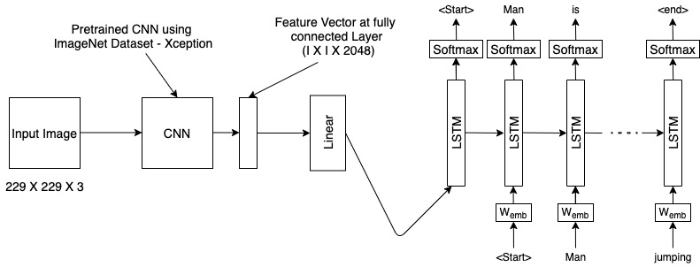

# Image_Caption_Generator by Lawrence

The idea behind this topic is to generate caption for a given image. Using this generated caption, select images which are similar to the input image using text similarity and provide the selected images as output.

In this project, we are going to use the two architectures of Deep Learning and they are CNN and RNN. CNN is usually used for image classification but works very well for image related operations. On the other hand, RNN is usually used to predict the sequence of things such as sentence, number and etc. So combining these two architectures, we are gonna create a system that is going to predict or generate image caption for an input image. 

<b><u>Model Architecture</u></b>

 
<b><u> Methodology</u></b>  
I am going to use a pre-trained model - <b>Xception</b> for extracting image features and these features are fed into LSTM i.e RNN to generate the captions for the given images. Once the caption for a given image is generated, text similarity i.e. cosine similarity is calculated between the generated caption and set of available captions in the system. The set of images are retrieved whose similarity score is above or equal to 90% and displayed to the user based on the number of images that the user had requested.
 
<b><u>Dataset</u></b>  
I am going to use the following datasets for training and validation of the model
<ul>
    <li>Flickr_8K => contains images</li>
    <li>Flickr_8K_text => contains a file called flickr8k.token which contains the image and its respective token</li>
</ul>
Flickr_8K image data can be downloaded from <a href="https://github.com/jbrownlee/Datasets/releases/download/Flickr8k/Flickr8k_Dataset.zip">Image</a> and Flickr_8K_text data can be downloaded from [Flickr_8K_text](https://github.com/jbrownlee/Datasets/releases/download/Flickr8k/Flickr8k_text.zip)
 
<b><u>Libraries</u></b>  

 The below given libraries are required to run the above files successfully. You can install the below given libraries using <b>pip</b> command in Python or putting these libraries in the <b>requrirements.txt</b> file along with their versions and install using the following commnad <b>pip install -r requirements.txt</b>
<ul>
    <li> Keras with Tensorflow</li>
    <li> NumPy </li>
    <li> Pickle </li>
    <li> Spacy </li>
    <li> PIL </li>
    <li> String </li>
    <li> OS </li>
</ul>